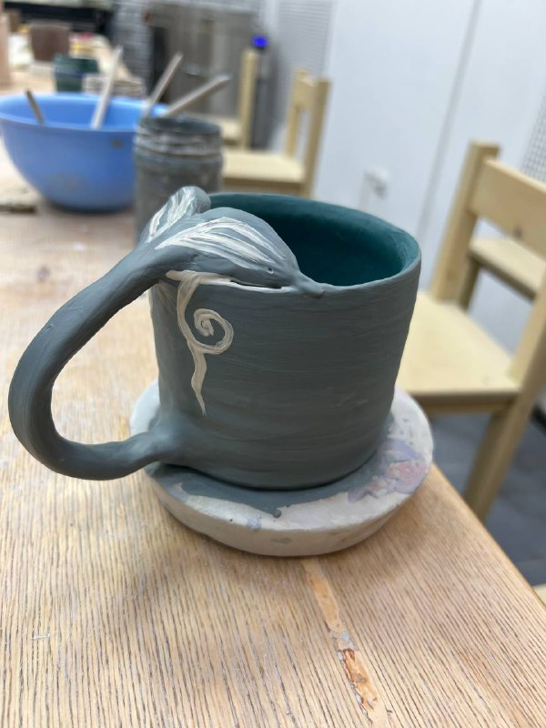

## Обзор

Обычно в моей неделе есть три типа дней:
1. Я хожу в университет, с огромной болью втсаю рано и иду на пары. Самые приеольные дни - дни семинаров по математике. Так проходит довольно много моих дней.
2. Дни когда я делаю домашнюю работу и занимаюсь самообразованием и подготовкой к всту пительным экзаменам. В такие дни я довольна собой больше всего, обычно они выходят довольно продуктивными.
3. И, пожалуй, моё любимое время - дни для общения с близкими людьми

[Можно посмотреть что занимает большую часть моего времени](https://github.com/VISimonova?tab=repositories)

спойлерэто дз

## Чем я чаще всего пользуюсь

- 👉 [**Моя любимая музыка**](https://music.yandex.ru/users/simo.viktoria/playlists/3?utm_medium=copy_link)
- 📚 [**А так я держу себя в форме**](https://youtube.com/@ChloeTing?si=KCgmVhA6pSPr6quk)

## Что же я делала на прошлой неделе?

На прошлой неделе было 8 марта и длинные выходные, пожтому мне повезло и я могу написать много всего интересного, не придётся ломать голову и придумыввать что-то.

* Я много гуляла по выставкам с молодым человеком, пыталась параллельно успеть сделать домашнее задание и бесконечные лабораторные по архитектуре

- Утром 8 марта мы сходили в гончарную мастерскую и я окончательно удостоверилась в том, что руки у меня из попы. Наверное поэтому мне подарили ещё и букетие из мармеладок, чтобы она слиплась. Но ещё подарили и МФР-ролл, чтобы её разлепить.

