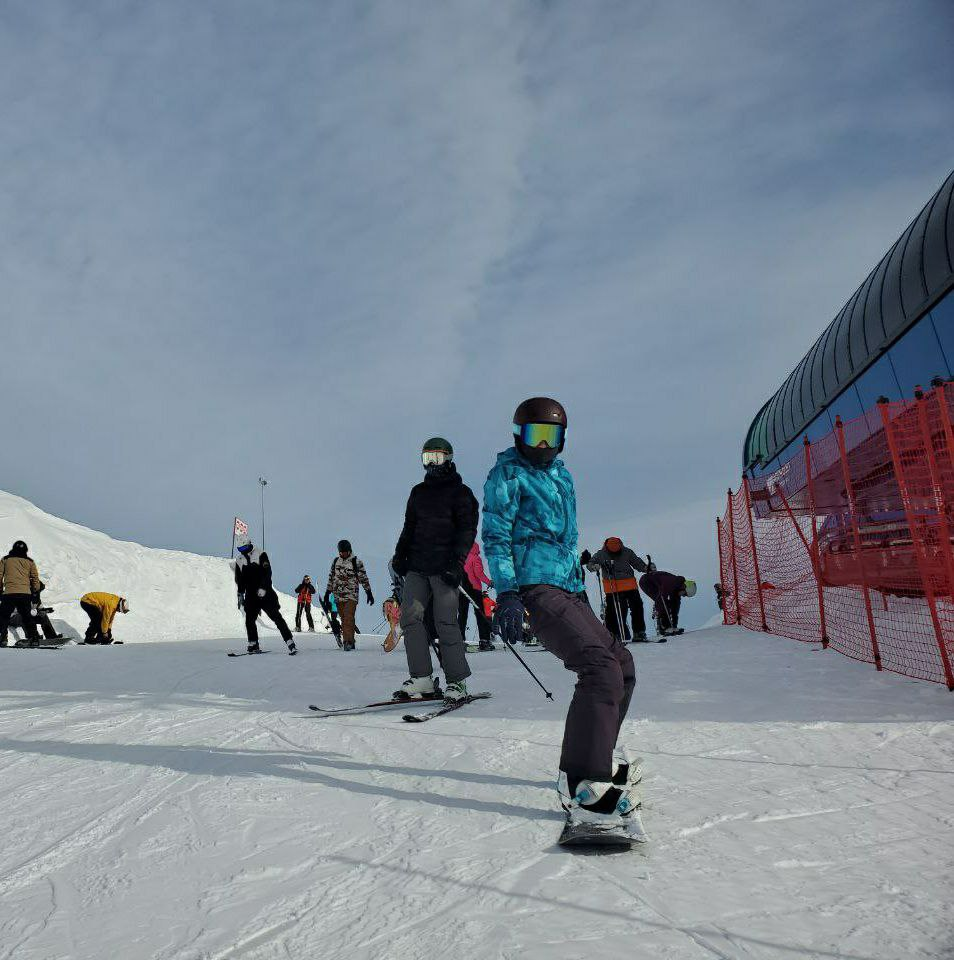

## Обзор

* я съездила в горы, покаталась на сноуборде, а заодно научилась кататься на горных лыжах
* после этого сильно заболела и сидела на антибиотиках

## Чем я чаще всего пользуюсь

- 👉 [**Моя любимая музыка**](https://music.yandex.ru/users/simo.viktoria/playlists/3?utm_medium=copy_link)
- 📚 [**А так я держу себя в форме**](https://youtube.com/@ChloeTing?si=KCgmVhA6pSPr6quk)

## Впечатления

Хочу сказать одно: оно однозначно того стоило

